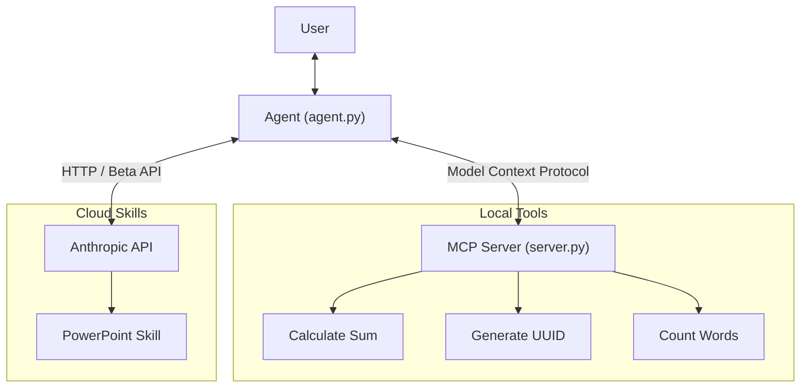

# Claude Agent with MCP & Skills

A robust AI agent that bridges local tools and server-side skills, showcasing the power of the **Model Context Protocol (MCP)** and **Anthropic Agent Skills**.

## Overview

This project implements a hybrid agent architecture:
1.  **Local Extensibility**: Connects to a local MCP server (`server.py`) to access custom Python functions as tools.
2.  **Cloud Capabilities**: Leverages Anthropic's **Agent Skills** (Beta) to perform complex tasks like generating PowerPoint presentations using the Claude API.

## Architecture

The system consists of three main components:

-   **Agent (`agent.py`)**: The core application logic. It initializes an MCP Client to discover local tools, configures the Anthropic Client with Beta capabilities (`skills-2025-10-02`), and orchestrates the conversation loop. It uses the `claude-sonnet-4-5-20250929` model.
-   **MCP Server (`server.py`)**: A lightweight FastMCP server that exposes local Python functions as standardized tools.
-   **Anthropic API**: usage of the hosted Claude model and prebuilt skills (e.g., `pptx`).



## Capabilities

### Custom MCP Tools
These tools are defined locally in `server.py` and run on your machine:
-   **`calculate_sum`**: Basic arithmetic addition.
-   **`echo_reverse`**: Reverses input strings.
-   **`generate_uuid`**: Generates a random version 4 UUID.
-   **`count_words`**: Counts the number of words in a text string.

### Agent Skills (Beta)
These skills are managed by Anthropic and executed in a secure sandboxed environment:
-   **PowerPoint Creation (`pptx`)**: The agent can plan and create multi-slide PowerPoint presentations from natural language prompts.

## Usage

1.  **Install Dependencies**:
    ```bash
    pip install -r requirements.txt
    ```
2.  **Set API Key**:
    Ensure `ANTHROPIC_API_KEY` is set in your `.env` file or environment.
3.  **Run the Agent**:
    ```bash
    python agent.py
    ```
    Once running, you can ask questions like:
    -   "What is 50 + 100?"
    -   "Generate a UUID"
    -   "Create a 1-slide presentation about AI Agents"

## Attribution

Built with **Google Antigravity**.
